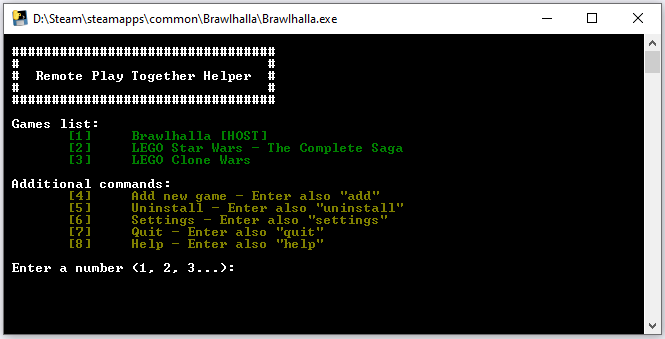
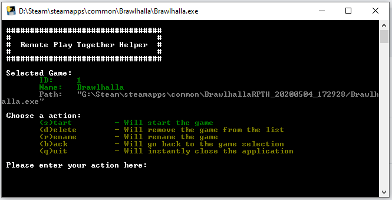

# Remote Play Together Helper

This tool will help you to use Steams Remote Play Together, with non-Steam Games.

## Installation

  - Download the latest release 
  - Run the executable and type "yes", to start the installation setup
  - Install a Remote Play Together compatible game via Steam (e.g. Brawlhalla (free game))
  - Right click on the game in steam -> Properties -> Local Files -> Browse local file
  - Copy the Path and insert it into the tool (e.g. C:/Program Files (x86)/Steam/steamapps/common/Brawlhalla/Brawlhalla.exe)
  - Now you can start your game (e.g. Brawlhalla) through steam, to start the tool

## Usage

To stat the tool, you have to start your downloaded game (e.g. Brawlhalla) through Steam.

### Main Menu

After starting the tool, you can use the following commands:
  - \<number\> - Will select your game or one of the listet commands
  - add - Will show a screen to add a game to the list
  - uninstall - Will show the uninstallation screen
  - settings - Will show the settings
  - quit - Will instantly close the tool
  - help - Will show the help page

### Game Selection

If you selected a game through \<number\> in the main menu. It will show the game selection screen.
There you can use the following commands:
  - start - Will start the selected game
  - delete - Will delete the selected game
  - rename - Will rename the selected game
  - back - Will go back to the main menu
  - quit - Will instantly close the tool

## Download

You can download the .exe file [here](https://github.com/tiuub/RemotePlayTogetherHelper/releases/latest).

## Information

The tool was compiled with pyinstaller.

## License

